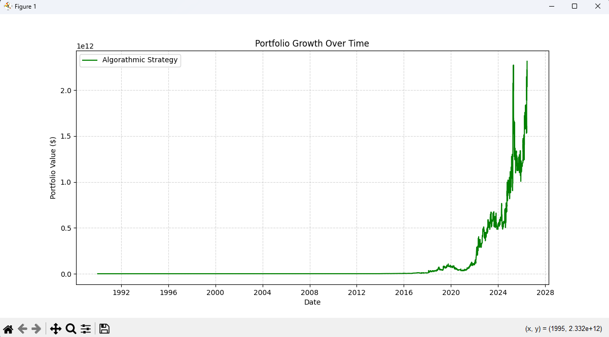

# Algorithmic Trading Backtester

A personal project built to learn data analysis and quantitative finance by simulating trading strategies against historical market data (specifically the VIX index).

## 📈 Performance Visualizer


## ⚡ What This Project Does (Core Features)
Instead of putting all my code into one giant file, I broke this simulator down into separate, modular components to practice good object-oriented programming:

- **Data Engine (`data_engine.py`)**: Uses `pandas` to load CSV files, convert date columns into proper datetime objects, and sort everything chronologically so the simulation runs forward in time correctly.
- **Portfolio Tracker (`portfolio.py`)**: Acts as my digital bank account. It tracks how much cash I have left, how many shares I currently hold, calculates my net worth daily, and prints out a clean transaction log of every trade.
- **Strategy Engine (`strategy.py`)**: Contains the math and logic rules for when to buy or sell based on market momentum over a rolling multi-day period.
- **Visualizer (`main.py`)**: Uses `matplotlib` to capture my total portfolio value on every single day of the simulation and plots it onto a growth chart.

## 🛠️ Tools Used
- **Language:** Python 3.13
- **Libraries:** Pandas (for data handling), Matplotlib (for charting)

## 🚀 Getting Started

### Prerequisites
Make sure you have Python installed, then install the required data libraries via your terminal:
```bash
pip install pandas matplotlib
'''
## 🧠 What I Learned & Real-World Realities

Building this simulator was a huge learning experience, especially when it came to debugging and understanding how real financial markets differ from a code sandbox:

    The Windows Path Trap: I hit a frustrating bug where my file wouldn't load because Windows backslashes (\) were being misread by Python as escape characters (like turning \vix into a vertical tab glitch). I learned how to fix this using raw strings (r"") and forward slashes (/).

    Data Chronology Matters: When I first loaded the historical data, the simulation was running backward because financial CSVs usually list the newest dates at the top. I had to learn how to sort the DataFrame chronologically and use .reset_index(drop=True) so my simulation loop stepped forward through time correctly.

    The Infinite Liquidity Assumption: While it's awesome to see my chart compound into huge numbers, this simulation assumes "infinite liquidity"—meaning it assumes you can instantly buy billions of dollars of an asset at the exact listed price without moving the market. In the real world, massive order sizes cause slippage and alter market prices.

    Index vs. Tradable Asset: This backtester runs against the raw VIX volatility index. In real life, you can't buy direct shares of the VIX itself; you have to trade options or futures, which introduce extra holding costs (like roll yield and decay) that a basic simulation doesn't capture.